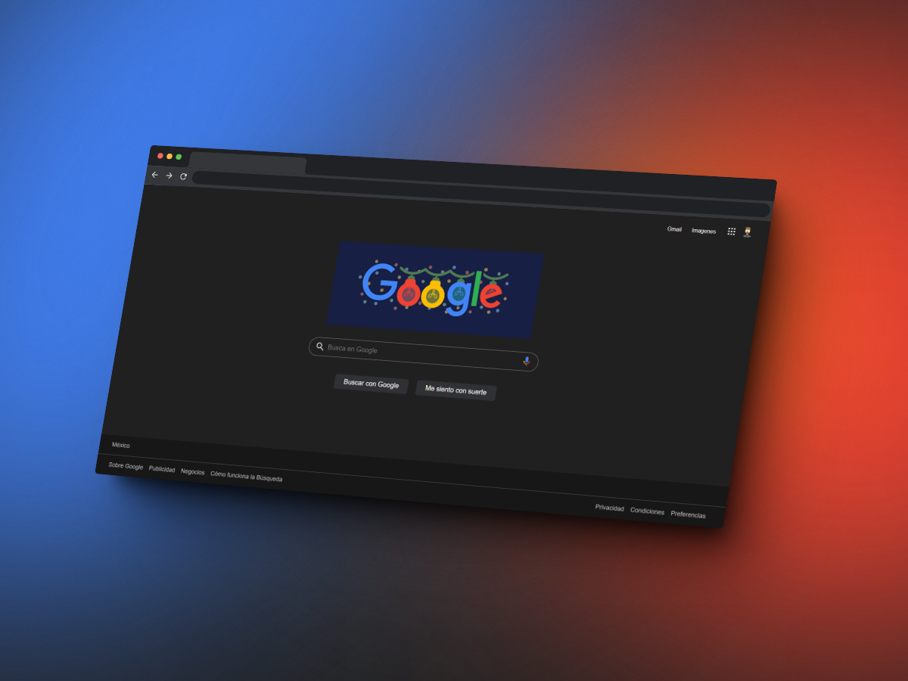

# Google Clone 🚀
This project is a clone of the main page of Google, the world's most popular search engine. The goal is to practice and showcase my skills in HTML and CSS, the fundamental languages for creating websites. 🌟

## Technologies Used 📝

  
  
  
  
  

# Design 🎨

  

# Features 💻
* The Google Clone has a responsive design that adapts to different screen sizes.
* The Google Clone allows for searches using the form in the center of the page, which redirects to **Google** search results.

